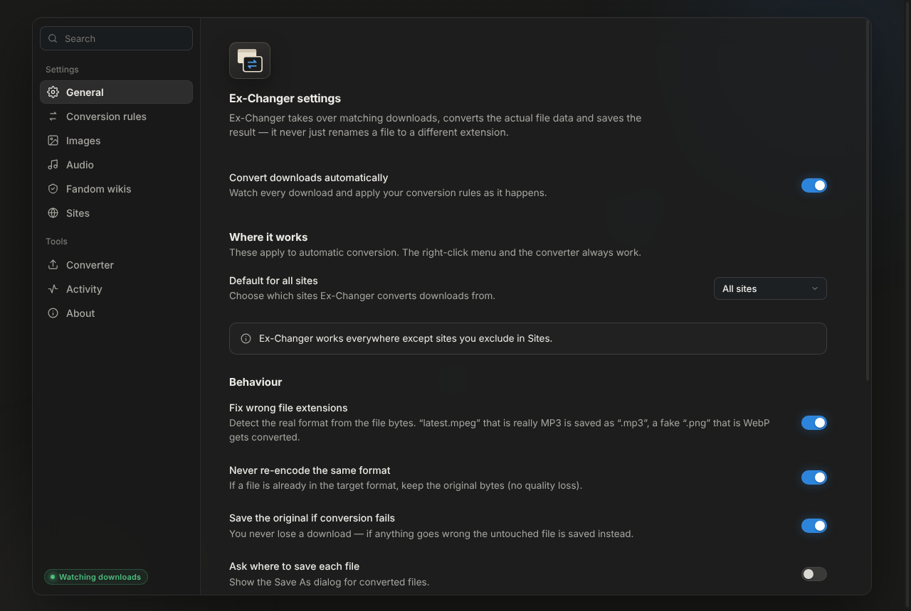

# Ex-Changer: a download converter browser extension

Ex-Changer converts files while you download them. It changes the data inside the file, so the result is a real file of the new format, not a renamed one.

| You download | You get |
|---|---|
| `latest.webp` from a Fandom wiki | `Character_Art.png`: the **original upload**, at full size |
| `latest.mpeg` (Fandom sound) | `Main_Theme.mp3`: kept byte-for-byte if it already is MP3 |
| `song.ogg`, `voice.opus` | `song.mp3`, `voice.mp3`, decoded and re-encoded with LAME |
| `clip.mpeg`, `clip.ts` (video) | `clip.mp3`: the audio track. An MP3 track is copied as-is; an MP2 track is decoded and re-encoded |
| `photo.webp`, `photo.avif` | `photo.png` |
| `image.png` that is really WebP | detected from its bytes and converted |

If a conversion fails, the original file is saved instead, so a download is never lost.



## Install (Chrome, Edge, Brave, Opera, Vivaldi)

1. Download or clone this repository.
2. Open `chrome://extensions` (Edge: `edge://extensions`).
3. Turn on **Developer mode**.
4. Click **Load unpacked** and select the `extension/` folder.
5. Pin Ex-Changer to the toolbar. The settings page opens on first install.

It needs Chrome 116 or newer. Firefox is not supported, because it has no `offscreen` documents and no `downloads.onDeterminingFilename`.

To build a zip for sharing or the Chrome Web Store, run `npm run build`. The zip is written to `dist/`.

## How it works

1. **Intercept.** `chrome.downloads.onDeterminingFilename` sees every download. If a download matches a rule, comes from Fandom, or its extension disagrees with its MIME type, the browser's copy is cancelled before it is written.
2. **Fetch.** An offscreen document fetches the file again. For Fandom it adds `format=original` (and drops `/scale-to-width-down/…`), so you get the uploaded file instead of the CDN's WebP re-encode.
3. **Detect.** The real format is read from the file's bytes (magic numbers), not from its name or headers.
4. **Convert.**
   - Images are decoded by the browser and re-encoded with canvas (PNG, JPEG, WebP) or a built-in BMP writer.
   - Audio is decoded with Web Audio (MP3, OGG, Opus, FLAC, WAV, AAC/M4A, MP4/WebM tracks). It is encoded to MP3 by [lamejs](https://github.com/zhuker/lamejs) in a worker, or written as WAV.
   - MPEG program/transport streams are demuxed in JS. MP2 audio, which browsers cannot decode, goes through a built-in MP2 decoder ported from [JSMpeg](https://github.com/phoboslab/jsmpeg).
5. **Save.** The result is saved under the real name with the correct extension.

### Loading
**Fandom → Load originals while browsing** adds a `declarativeNetRequest` rule. Wiki images then load in their original format, so drag-and-drop, copy, and "Save image as…" also give you PNG or JPEG.

### Other tools
- **Right-click menu:** *Ex-Changer → Save image as PNG / JPEG / WebP / BMP*, *Save audio as MP3 / WAV*, *Save linked file as …*, *Save original (fix name only)*.
- **Converter page:** drop local files, or paste a link. Everything runs locally and nothing is uploaded.
- **Activity:** live progress, sizes, *show in folder*, *retry*.

## Settings

| Section | Options |
|---|---|
| General | on/off, scope (all sites / Fandom only / allow list), fix wrong extensions, never re-encode the same format, fallback to original, Save As dialog, subfolder, underscores → spaces, conflict action, size limit, notifications, context menu |
| Conversion rules | target per source format (14 image/audio formats, 5 video containers) + presets |
| Images | JPEG/WebP quality, JPEG background colour, max dimension |
| Audio | MP3 bitrate (96–320 kbps), channels, sample rate, WAV bit depth |
| Fandom | real file names, original upload, full size from thumbnails, load originals while browsing |
| Sites | allow list and exclude list |

## Limitations
- Video is not re-encoded to another video format. Video files can only be turned into audio (MP3/WAV).
- Animated WebP/GIF are converted from the first frame.
- HEIC cannot be decoded by Chromium.
- AAC/H.264 decoding depends on the browser build. Google Chrome and Edge have it; some open-source Chromium builds do not.
- Downloads that a page generates as `blob:` URLs cannot be fetched again, so they are left untouched.

## Development

```bash
npm install            # Playwright, for tests and screenshots
npm run test:unit      # format sniffing, Fandom URLs, rules, MP2 decoder, MPEG demuxers
npm run test:e2e       # real Chromium + the extension + a fake Fandom CDN
npm run screenshots    # docs/screenshots/*.png
npm run icons          # regenerate extension/icons from the SVG logo
npm run fixtures       # regenerate tests/fixtures with ffmpeg
```

```
extension/
  manifest.json
  src/background.js          service worker: interception, jobs, saving, menus, DNR
  src/offscreen/             conversion engine host (fetch → convert → blob URL)
  src/lib/formats.js         format tables + byte sniffing
  src/lib/filename.js        Fandom URL handling, naming, sanitising
  src/lib/rules.js           interception and output decisions
  src/lib/settings.js        defaults and storage
  src/lib/convert/           image, audio (WAV/MP3), MP2 decoder, MPEG-PS/TS demuxer
  src/workers/mp3-worker.js  LAME encoder worker
  src/popup/, src/options/   UI
  src/ui/                    theme, ambient canvas background, icons
  src/vendor/lamejs.js       @breezystack/lamejs 1.2.7 (LGPL-3.0)
```

## Credits
- MP3 encoding: lamejs, via [@breezystack/lamejs](https://www.npmjs.com/package/@breezystack/lamejs) (LGPL-3.0, see `extension/src/vendor/LAMEJS-LICENSE.txt`).
- MP2 decoding: adapted from JSMpeg by Dominic Szablewski (MIT), which is based on kjmp2 by Martin J. Fiedler.
